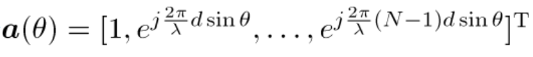
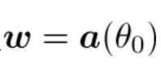
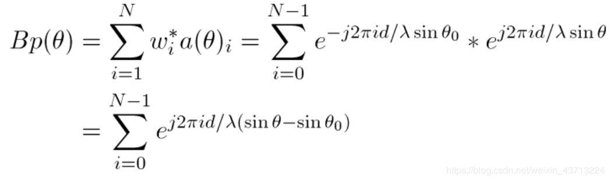
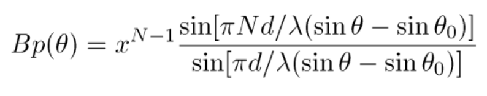
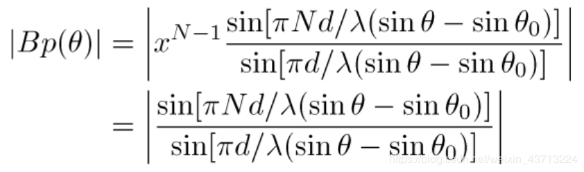
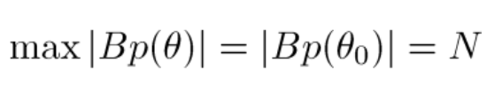

# 波束形成（Beamforming）

## 在声呐系统应用：

目前世界各国都致力于水下目标定位算法的研究，采用声呐进行水下定位可分为主动声呐和被动声呐。主动是声呐本身需要辐射声波，把接收目标反射波作为检测估计的基础，虽然现在主动声呐仍然是海军主力声设备，但是主动声呐存在着隐蔽性差的缺点。而被动声呐不向外发波，隐蔽性好，不易被发现水下工作时间长等优点，在实际应用中作用越来越大所以必须加大研究被动声呐探测定位技术。对被动声定位的研究主要是对波束形成算法的研究。波束形成大致可分为两类：传统波束形（Conventional Beamforming, CBF）成和自适应波束形成（Adaptive Beamforming ，ABF ）。

波束成形源于自适应天线的一个概念。接收端的信号处理，可以通过对多天线阵元接收到的各路信号进行加权合成，成形所需的理想信号。从天线方向图视角来看，这样做相当于成形了规定指向上的波束。在水声环境中，接收阵元接收信号信噪比低，不利于水声定位精度的提升，而利用波束成形技术，可以抵消干扰，提高接收信噪比。

## 波束形成本质：
多个传感器的数据（发射/接收） 经过一系列运算或延时、加权等处理， 得到增益加权相加使得某个方向的输出增大， 相当于指向了该方向使指定方向的信号通过，对其他一些空间方向来的噪声和干扰有所抑制，也称为空域滤波。波束形成可以用模拟方法和数字方法实现。当前已广泛使用数字方法。波束图亦称方向图，呈花瓣形，其中发射能力最集中或接收响应最高的波束称主波束（又称主瓣），在主波束旁侧一系列较低的波束称为旁瓣或副瓣。

## **应用场景**：

雷达、 声呐、 导航、 地震波探测、 语音处理、 移动通信、 医用超声设备。

## 传统波束形成器(Conventional Beamforming, CBF)
对于时域的波束成形通常有两种方法：相移波束形成和时延波束形成。在基元之间插入相移使主波束极大方向控制于不同方位的方法称为相移波束成形，而插入时延使波束控制于不同方位的方法称之时延波束形成。

在主动声呐中，长应用相移波束形成；在被动声呐中，则用时延波束形成。采用时延波束形成，对接收信号进行滤波处理。

## 波束图Bp(θ)

波束图是CBF对不同来波方向的响应。
BF的加权向量w确定后（例如CBF：w=a(30°)），该BF对θ∈R的响应Polar图即为波束图。

## 均匀线阵(ULA)CBF的波束图

方向向量：

加权向量：

波束图：

